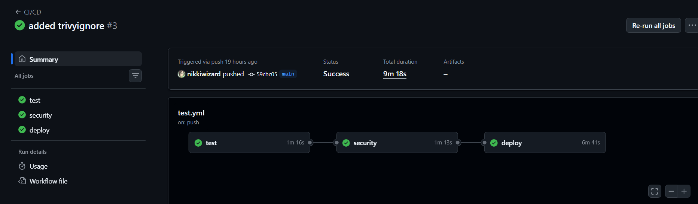
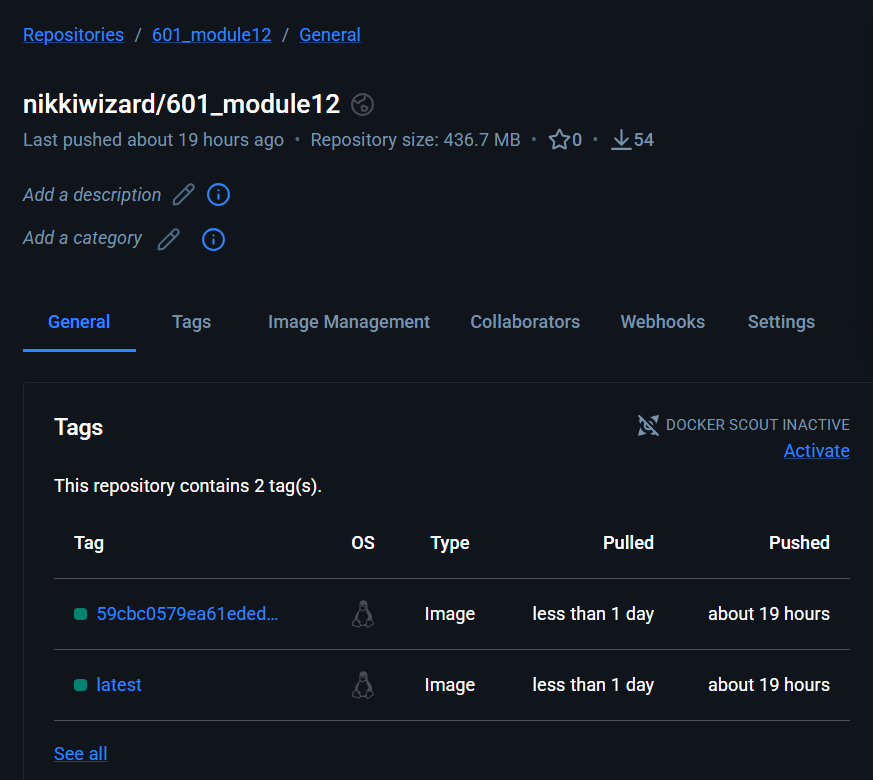
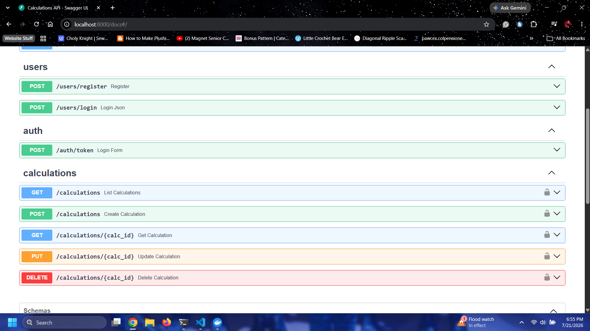

## Module 12

## DockerHub URL:
https://hub.docker.com/repository/docker/nikkiwizard/601_module12/general

## Github Actions Run:

## DockerHub Screenshot:

## App Screenshot:

## Running Tests
Before running tests, be sure that Docker is up and running with the following command:  
docker compose up --build

To run tests locally, follow these commands:  
python3 -m venv venv  
source venv/bin/activate  
pip install -r requirements.txt  
docker compose exec web pytest  

A note: You could run pytest instead of docker compose exec web pytest but I had some trouble with just pytest.  

You can also manually test your application by doing manual checks via OpenAPI going to http://localhost:8000/docs. You can test registration, login, auth, and all the calculation endpoints by clicking "Try it out". 